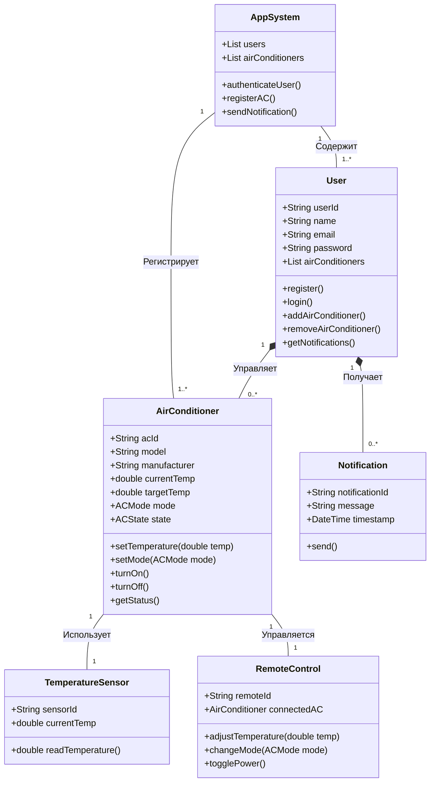

```mermaid
classDiagram
    class User {
        +String userId
        +String name
        +String email
        +String password
        +List<AirConditioner> airConditioners
        +register()
        +login()
        +addAirConditioner()
        +removeAirConditioner()
        +getNotifications()
    }

    class AirConditioner {
        +String acId
        +String model
        +String manufacturer
        +double currentTemp
        +double targetTemp
        +ACMode mode
        +ACState state
        +setTemperature(double temp)
        +setMode(ACMode mode)
        +turnOn()
        +turnOff()
        +getStatus()
    }

    class Notification {
        +String notificationId
        +String message
        +DateTime timestamp
        +send()
    }

    class TemperatureSensor {
        +String sensorId
        +double currentTemp
        +double readTemperature()
    }

    class RemoteControl {
        +String remoteId
        +AirConditioner connectedAC
        +adjustTemperature(double temp)
        +changeMode(ACMode mode)
        +togglePower()
    }

    class AppSystem {
        +List<User> users
        +List<AirConditioner> airConditioners
        +authenticateUser()
        +registerAC()
        +sendNotification()
    }


    User "1" *-- "0..*" AirConditioner : Управляет
    User "1" *-- "0..*" Notification : Получает
    AirConditioner "1" -- "1" TemperatureSensor : Использует
    AirConditioner "1" -- "1" RemoteControl : Управляется
    AppSystem "1" -- "1..*" User : Содержит
    AppSystem "1" -- "1..*" AirConditioner : Регистрирует
```
